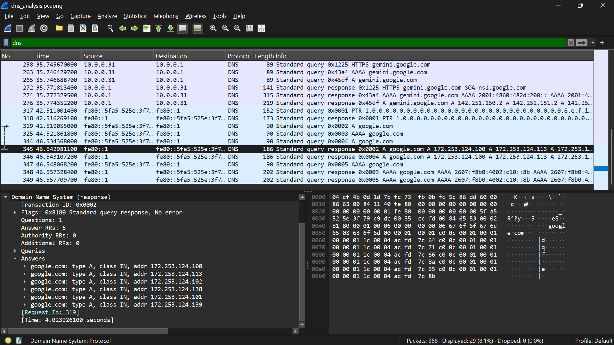

# Network Traffic Analysis & DNS Inspection using Wireshark

## Project Overview
This project demonstrates packet-level network analysis and protocol inspection using **Wireshark**. The primary objective was to capture live network interface traffic, isolate protocol-specific communications using display filters, and analyze Domain Name System (DNS) query/response structures for operational monitoring and threat investigation.

## Technical Execution & Methodology
* **Traffic Capture:** Captured raw network packets across active wireless interfaces using Wireshark / TShark utilities.
* **Protocol Filtering:** Utilized targeted display filters (`dns`, `udp.port == 53`) to suppress background network noise.
* **Payload Inspection:** Analyzed DNS query records (Type A / AAAA) and response payloads to verify domain resolution behavior and operational integrity.

## Key Evidence

### DNS Protocol Analysis

*Figure 1: Filtered Wireshark trace showcasing DNS query structure and resolution payloads.*

## Key Competencies Demonstrated
* **Packet Forensics:** Deep packet inspection (DPI) of Layer 4 (UDP) and Layer 7 (DNS) protocols.
* **Wireshark Display Filters:** Crafting syntax-based filters to accelerate SOC triage and investigation workflows.
* **Network Baseline Analysis:** Identifying normal vs. anomalous network behavior across endpoint interfaces.
